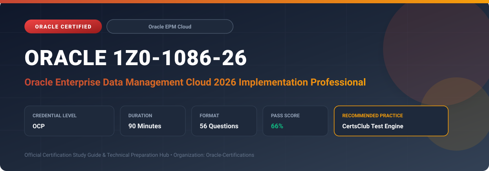

  

# Oracle 1Z0-1086-26: Oracle Enterprise Data Management Cloud 2026 Implementation Professional

---

## 1. Exam Overview & Candidate Profile

The **Oracle 1Z0-1086-26: Oracle Enterprise Data Management Cloud 2026 Implementation Professional** examination is engineered for enterprise architects, solution specialists, functional consultants, and implementation professionals seeking formal industry recognition of their proficiency in Oracle technologies.

The Oracle Enterprise Data Management Cloud 2026 Implementation Professional (1Z0-1086-26) certification certifies your technical skills to implement and administer Oracle Enterprise Data Management (EDM) Cloud. Candidates prove competence in managing master data, dimension structures, hierarchy governance, change request workflows, subscriptions, validations, and syndication across EPM, ERP, and bespoke target applications.

### Target Audience & Prerequisites
- **Target Roles**: Implementation Specialists, Cloud Architects, Technical Leads, Enterprise Functional Consultants, and Systems Engineers.
- **Recommended Experience**: 1–2 years of practical, hands-on experience designing, implementing, and maintaining corresponding Oracle Cloud solutions.
- **Credential Earned**: Oracle Certified Professional (OCP).

---

## 2. Key Exam Specifications

| Specification | Details |
| :--- | :--- |
| **Exam Code** | **Oracle 1Z0-1086-26** |
| **Official Title** | Oracle Enterprise Data Management Cloud 2026 Implementation Professional |
| **Certification Track** | Oracle Enterprise Performance Management Cloud |
| **Exam Duration** | 90 Minutes |
| **Number of Questions** | 56 Questions |
| **Passing Score** | 66% |
| **Question Format** | Multiple Choice (Single/Multiple Answer), Scenario-Based Questions |
| **Delivery Provider** | Oracle University / Pearson VUE (Online Proctored or Test Center) |
| **Recommended Practice Engine** | [CertsClub Oracle Practice Tests](https://www.certsclub.com/oracle/1z0-1086-26-dumps.html) |

---

## 3. Official Blueprint & Exam Domain Breakdown

The examination assesses candidate competencies across core functional domains weighted as follows:

| Domain Area | Weighting |
| :--- | :--- |
| **EDM Cloud Architecture, Applications & Dimensions** | `25%` |
| **Node Types, Hierarchies & Property Definitions** | `25%` |
| **Request Management, Workflows & Approvals** | `20%` |
| **Subscriptions, Compares & Alternate Views** | `15%` |
| **Data Migration, Integration, Audit & Security** | `15%` |

---

## 4. Deep Dive into Complex & Challenging Technical Topics

To secure a passing score on the 1Z0-1086-26 exam, candidates must master the following advanced concepts:

- **Modeling application types**: Financials Cloud General Ledger, Planning, Financial Consolidation and Close, and Custom Applications.
- Creating viewpoint structures, node types, node sets, and inheritance properties across multiple business contexts.
- **Designing collaborative governance workflows**: submitters, approvers, commit stages, and policy definitions.
- Automating cross-application subscriptions to synchronize master data changes (e.g., adding an account in GL triggers updates in Planning).

---

## 5. Scenario-Based Demo & Practice Questions

### Question 1
In Oracle Enterprise Data Management Cloud, what mechanism allows changes made to a Chart of Accounts hierarchy in an ERP application viewpoint to automatically generate change requests in downstream Planning application viewpoints?

A) Data Management Load Rules
B) Subscriptions
C) EPM Automate Replay
D) Supplemental Data Manager

- **Correct Answer**: `B) Subscriptions`  
- **Technical Explanation**: Subscriptions in EDM Cloud listen for committed changes in a source viewpoint and automatically generate requests in target viewpoints, ensuring synchronized master data governance across enterprise applications.

---

### Question 2
Which EDM Cloud feature allows an administrator to visually evaluate the structural and property differences between two distinct hierarchy versions or viewpoints side by side?

A) Viewpoint Compare
B) Node Type Inspector
C) Audit Report
D) Rule Balancing

- **Correct Answer**: `A) Viewpoint Compare`  
- **Technical Explanation**: The Viewpoint Compare feature provides an intuitive side-by-side reconciliation of two viewpoints, highlighting structural variances, missing nodes, and differing property values.

---

## 6. Recommended Preparation Strategy & Practice Testing Engine

Achieving certification in **Oracle 1Z0-1086-26** requires balanced theoretical study and scenario-based simulation practice:

1. **Review Oracle Documentation**: Master architecture guides, implementation workbooks, and administration manuals on the Oracle Help Center.
2. **Hands-on Lab Practice**: Execute real-world configuration, policy setup, and troubleshooting tasks in your cloud tenancy or test instance.
3. **Simulated Exam Drills**: Practice answering timed, scenario-based multiple-choice questions to familiarize yourself with the question formats, traps, and timing constraints.

### Practice With CertsClub
For realistic practice questions, updated dumps, and mock testing environments:
- **Resource**: [CertsClub Oracle Practice Test Engine](https://www.certsclub.com/oracle/1z0-1086-26-dumps.html)
- **Special Discount**: Use coupon code **`club20`** during checkout for an instant **20% discount** on all practice exam bundles and testing engines.

---

## 7. Official Documentation & References

- [Oracle University Certification Registry](https://education.oracle.com/)
- [Oracle Help Center Documentation Portal](https://docs.oracle.com/)
- [Oracle Cloud Infrastructure & Applications Guides](https://docs.oracle.com/en/cloud/)
- [CertsClub Oracle Certification Exam Practice](https://www.certsclub.com/oracle/1z0-1086-26-dumps.html)

---

## 8. SEO & Discovery Keywords

`oracle 1z0-1086-26, oracle 1z0-1086-26 exam, oracle 1z0-1086-26 dumps, 1Z0-1086-26 practice questions, 1Z0-1086-26 study guide, oracle 1z0-1086-26 syllabus, oracle enterprise data management cloud 2026 implementation professional, certsclub 1z0-1086-26`
